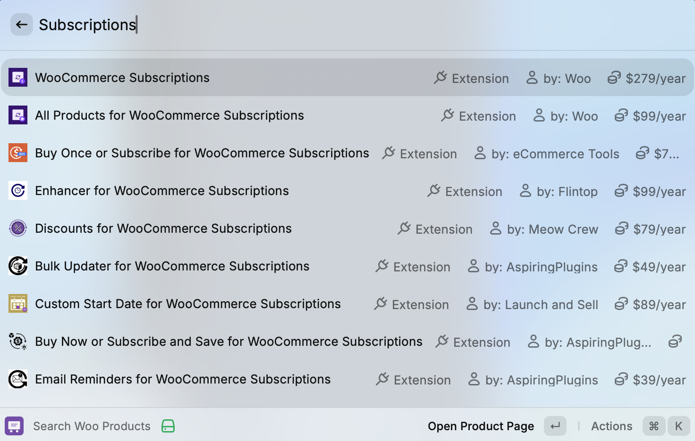
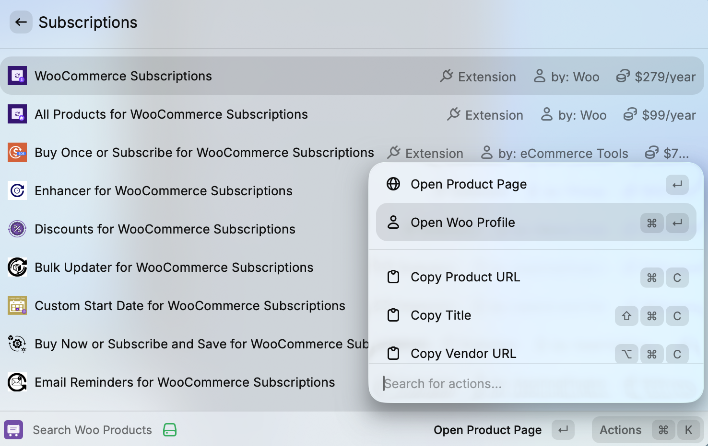

# Woo Marketplace Search

Search themes, extensions, and documentation directly on WooCommerce.com from Raycast.

## Features

- **Search Products** - Find themes and extensions on WooCommerce.com
- **Search Docs** - Search documentation, guides, and blog posts
- **Instant Results** - Powered by Algolia for fast search
- **Vendor Info** - View vendor profiles and details
- **Quick Actions** - Open in browser, copy URLs

<p align="center">
  
</p>
<p align="center">
  
</p>
<p align="center">
  
</p>

## Quick Access

| Command             | Keywords | Description                |
| ------------------- | -------- | -------------------------- |
| Search Woo Products | `wce`    | Search themes & extensions |
| Search Woo Docs     | `wcd`    | Search documentation       |

Just type `wce` or `wcd` in Raycast!

## Installation

### Prerequisites

- [Raycast](https://raycast.com/) installed.
- [Node.js](https://nodejs.org/) (v18 or higher).
- `npm` (comes with Node.js).

### Steps

1. **Clone the repository**

   ```
   Download zip from release, or git clone https://github.com/shameemreza/woo-marketplace-search.git
   cd woo-marketplace-search
   ```

2. **Install dependencies**

   ```
   npm install
   ```

3. **Run the extension**

   ```
   npm run dev
   ```

4. **Use in Raycast**
   - Open Raycast.
   - Type `wce` for products or `wcd` for docs.
   - Start searching!

## Development

```
# Install dependencies
npm install

# Run in development mode (hot reload)
npm run dev

# Build for production
npm run build

# Lint code
npm run lint

# Fix lint issues
npm run fix-lint
```

## Project Structure

```
woo-marketplace-search/
├── src/
│   ├── api.ts              # Algolia API integration
│   ├── types.ts            # TypeScript types
│   ├── search-extensions.tsx  # Products search command
│   └── search-docs.tsx     # Docs search command
├── assets/
│   └── command-icon.svg    # Extension icon
├── package.json
└── README.md
```

## License

MIT License - see [LICENSE](LICENSE) for details.

## Author

**Shameem Reza** - [@shameemreza](https://github.com/shameemreza).

---

Made with ❤️ for the WooCommerce community.
